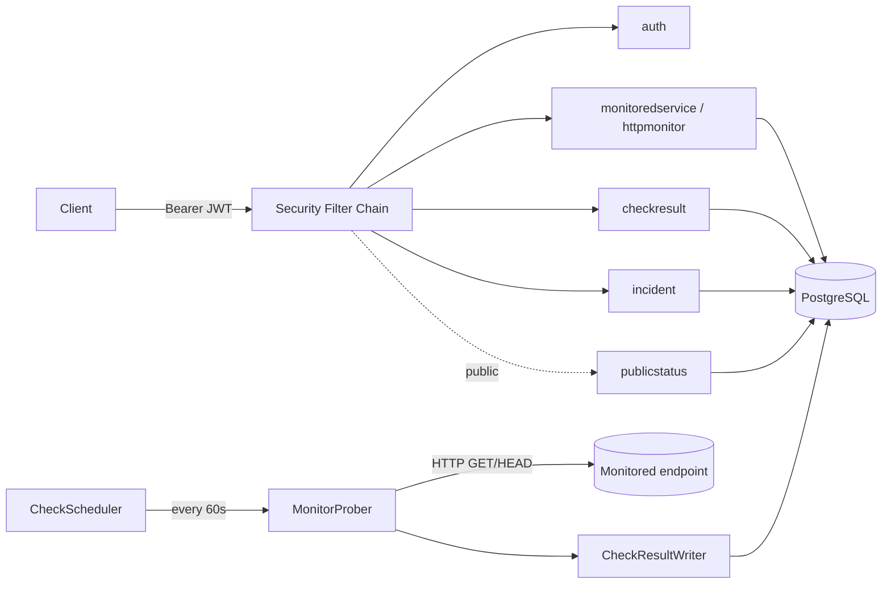

# PulseOps Lite

[](https://github.com/matejapp/pulse-ops-backend/actions/workflows/workflow.yml)
[](https://openjdk.org/projects/jdk/21/)
[](https://spring.io/projects/spring-boot)
[](LICENSE)

A backend service for monitoring HTTP endpoints and managing incidents, built with Spring Boot. It polls registered services on a schedule, records the result of every check, flags a service as degraded after repeated failures, and exposes a public status-page API so anyone can see current health and incident history without logging in.

## The problem it solves

If you run a handful of services, you want to know when one goes down before your users tell you. PulseOps covers that loop end to end: register a service, attach one or more HTTP checks to it, and a scheduler polls them every 60 seconds. When a check fails three times in a row the service is marked degraded; one successful check restores it. Operators can open an incident, post timestamped updates, and move it through a status lifecycle, all of which is visible on a public, unauthenticated status endpoint.

The scope is intentionally backend-only — no frontend, no message queue, no Kubernetes. What it does have is real authentication, scheduled background work, a versioned relational schema, and a tested REST API.

## Features

- **JWT authentication** — register/login with stateless, HS256-signed access tokens; roles (`ADMIN`, `RESPONDER`) mapped from the token into Spring Security authorities.
- **Service & monitor management** — register services, attach HTTP checks (method, target URL, expected status), admin-gated writes.
- **Scheduled health checks** — a bounded thread pool polls every enabled monitor every 60 seconds and records latency, response status, and errors.
- **Automatic status calculation** — 3 consecutive failures degrade a monitor, 1 success recovers it; service-level status is derived at read time from its monitors.
- **Paginated check history** — every check result is queryable per monitor, newest first.
- **Incident management** — open incidents against a service, post timeline updates, forward-only status lifecycle (`INVESTIGATING → MONITORING → RESOLVED`).
- **Public status API** — unauthenticated endpoints for overall status, active incidents, and incident detail — the data a status page would render.
- **OpenAPI / Swagger UI** — interactive API docs with bearer-token auth support.
- **CI** — GitHub Actions builds and runs the full test suite on every push/PR.

> [!NOTE]
> Swagger UI (`/swagger-ui.html`) and the OpenAPI document (`/v3/api-docs`) are intentionally public — no token required to browse the API surface.

## Tech stack

- Java 21, Spring Boot 4.1.0 (Jackson 3)
- Spring Web MVC for the REST API
- Spring Data JPA + Hibernate over PostgreSQL 16
- Flyway for versioned database migrations
- Spring Security + OAuth2 Resource Server for stateless JWT auth (HS256)
- Jakarta Bean Validation for request validation
- Spring Boot Actuator for health checks
- springdoc-openapi for OpenAPI 3 / Swagger UI
- JUnit 5, Mockito, and MockMvc for tests
- Docker Compose for the local database
- GitHub Actions for CI
- Maven as the build tool

## Architecture

The code is organized **by feature**, not by technical layer — everything related to one capability lives together instead of being spread across parallel `controller` / `service` / `repository` trees.



```
com.mateja.pulseops
├── auth              registration, login, JWT issuing
├── monitoredservice   the service being watched
├── httpmonitor        an HTTP check attached to a service, and its live status
├── checkresult        scheduler, prober, and the history of individual checks
├── incident           manual incidents and their update timeline
├── publicstatus       unauthenticated status/incident read API
├── security           security config, JWT encoder/decoder, properties
├── config             OpenAPI config, admin bootstrap seeder
└── common.web         shared error handling (RFC 7807)
```

Within a feature, layers stay consistent:

- `web` — controllers and request/response records (DTOs)
- `application` — service classes with the business logic
- `domain` — JPA entities and enums (state transitions live here, not in services)
- `persistence` — Spring Data repositories

## Design decisions

**Stateless JWT, no sessions.** Every request carries a Bearer token validated by the server against a shared secret — no session storage, no sticky sessions, trivially horizontally scalable. There are no refresh tokens; access tokens live for one hour.

**Roles live in the token, mapped to authorities on the way in.** The login response embeds a `roles` claim; a `JwtGrantedAuthoritiesConverter` turns it into `ROLE_`-prefixed Spring authorities so `hasRole("ADMIN")` works as expected.

**Login errors are intentionally vague.** A wrong password and an unknown email both return the same 401 with the same message, so the endpoint can't be used to enumerate registered accounts.

**Flyway owns the schema, Hibernate only validates it.** Hibernate runs in `validate` mode — it checks entities match the tables but never alters the database. All schema changes are numbered SQL migrations, explicit and reviewable.

**Service status is derived, not stored.** There is no status column on `monitored_service`. A service's status is computed at read time from the worst status among its monitors (`DEGRADED > OPERATIONAL > UNCHECKED`), which avoids a second write path that could drift out of sync with the monitor data.

**The HTTP call never happens inside a transaction.** `MonitorProber` makes the outbound network call outside any transaction, then hands the result to a separate `@Transactional` writer that saves the monitor's new status and the check result atomically. A 5-second read timeout is never allowed to hold a database connection open.

**Errors follow RFC 7807.** Failures come back as `application/problem+json` with a consistent shape; validation failures include a per-field error map.

**No self-assigned admin.** Public registration always creates a `RESPONDER` — there is no privilege-escalation path through the API. The first `ADMIN` account is seeded idempotently at startup from `ADMIN_EMAIL` / `ADMIN_PASSWORD` (see [Configuration](#configuration)).

## Data model

Six tables, Flyway-migrated (`V1`–`V5`):

| Table | Purpose |
|---|---|
| `app_users` | Accounts: email, BCrypt hash, role (`ADMIN`/`RESPONDER`). |
| `monitored_service` | A service being watched, e.g. "Payments API". Name is unique, case-insensitive. |
| `http_monitor` | An HTTP check belonging to a service — target URL, method (`GET`/`HEAD`), expected status, `status` (`OPERATIONAL`/`DEGRADED`/`UNCHECKED`), `consecutive_failures`. Deleting a service cascades to its monitors. |
| `check_result` | One row per executed check — success flag, response status, latency, error message, timestamp. |
| `incident` | A manually opened incident against a service — title, current status, timestamps. Deleting a service cascades to its incidents. |
| `incident_update` | A frozen timeline entry (status + message) belonging to an incident. |

## Getting started

### Prerequisites

- JDK 21+ (build targets Java 21)
- Docker, for the local Postgres container

### 1. Configure environment

Create a `.env` file in the project root (git-ignored — never commit it):

```
POSTGRES_USER=postgres
POSTGRES_PASSWORD=change-me
POSTGRES_DB=PulseOps
POSTGRES_PORT=5433

JWT_SECRET=<base64-encoded random key, at least 32 bytes>

ADMIN_EMAIL=admin@example.com
ADMIN_PASSWORD=change-me-too
```

> [!IMPORTANT]
> `ADMIN_EMAIL` and `ADMIN_PASSWORD` are required — the app seeds the first `ADMIN` account from them on startup and will fail to boot if they're unset.

Generate a JWT secret (must be standard Base64, decoding to ≥256 bits):

```powershell
$b = New-Object byte[] 32
[Security.Cryptography.RandomNumberGenerator]::Create().GetBytes($b)
[Convert]::ToBase64String($b)
```

### 2. Start the database and run the app

```
docker compose up -d
./mvnw spring-boot:run
```

`spring-boot-docker-compose` auto-wires the datasource from the running container, and Flyway applies migrations on startup. Postgres listens on `5433` locally to avoid clashing with a native install on the default `5432`.

### 3. Explore the API

- Swagger UI: `http://localhost:8080/swagger-ui.html`
- Health check: `http://localhost:8080/actuator/health`
- Public status: `http://localhost:8080/api/public/status`

Register a user, log in for a token, then use the "Authorize" button in Swagger UI to attach it as a Bearer token for the protected endpoints.

### Run the tests

```
./mvnw clean verify
```

## Configuration

<details>
<summary>Full environment variable reference</summary>

| Variable | Required | Description |
|---|---|---|
| `POSTGRES_USER` | Yes | Postgres username, also used by the container's healthcheck. |
| `POSTGRES_PASSWORD` | Yes | Postgres password. |
| `POSTGRES_DB` | Yes | Database name. |
| `POSTGRES_PORT` | No (default `5432`) | Host-side port the container publishes; kept at `5433` locally to avoid clashing with a native Postgres. |
| `JWT_SECRET` | Yes | Base64-encoded HS256 signing key, ≥256 bits. Fails fast at boot if shorter. |
| `ADMIN_EMAIL` | Yes | Email for the seeded bootstrap admin account. |
| `ADMIN_PASSWORD` | Yes | Password for the seeded bootstrap admin account (BCrypt-hashed before storage). |

</details>

Key application properties (`src/main/resources/application.properties`):

- `spring.jpa.hibernate.ddl-auto=validate` — schema is Flyway-owned, Hibernate never mutates it.
- `spring.jpa.open-in-view=false` — no lazy-loading surprises outside a transaction boundary.
- `pulseops.security.jwt.access-token-ttl=3600s` — access tokens are valid for one hour.

## API reference

Full interactive docs live at `/swagger-ui.html` once the app is running. Summary:

| Method | Path | Auth | Description |
|---|---|---|---|
| POST | `/api/auth/register` | Public | Create an account (always `RESPONDER`), 201 |
| POST | `/api/auth/login` | Public | Exchange credentials for a JWT |
| GET | `/actuator/health` | Public | Liveness check |
| GET | `/api/public/status` | Public | Overall + per-service derived status |
| GET | `/api/public/incidents` | Public | Active (unresolved) incidents, newest first |
| GET | `/api/public/incidents/{id}` | Public | One incident + its update timeline |
| POST | `/api/services` | ADMIN | Register a monitored service |
| GET | `/api/services` | Authenticated | List all services |
| DELETE | `/api/services/{id}` | ADMIN | Delete a service (cascades to its monitors) |
| POST | `/api/services/{serviceId}/monitors` | ADMIN | Attach an HTTP monitor to a service |
| GET | `/api/services/{serviceId}/monitors` | Authenticated | List a service's monitors |
| DELETE | `/api/services/{serviceId}/monitors/{id}` | ADMIN | Delete a monitor |
| GET | `/api/monitors/{monitorId}/results` | Authenticated | Paginated check history, newest first |
| POST | `/api/incidents` | Authenticated | Open an incident against a service |
| POST | `/api/incidents/{id}/updates` | Authenticated | Post a timeline update / change status |
| GET | `/api/incidents` | Authenticated | List all incidents |
| GET | `/api/incidents/{id}` | Authenticated | One incident + its timeline |

`ADMIN`-only routes require the `ADMIN` role; everything else marked "Authenticated" accepts either `ADMIN` or `RESPONDER`. Anything not listed above defaults to authenticated-only (secure by default).

## Testing

74 tests: service-layer unit tests (JUnit + Mockito) and web-slice tests (`@WebMvcTest` + MockMvc) that exercise real Spring Security filters — success paths plus 400/401/403/404/409 responses, including the JWT role-to-authority mapping. Entity state machines (status transitions, incident lifecycle) are covered with pure, mock-free unit tests.

The project deliberately does not use Testcontainers or hit a real database in tests, to keep the suite fast and focused on application logic — schema and integration behavior are verified manually against the real Postgres container.

## Contributing

This is an individually maintained project. Issues and suggestions are welcome; it is not currently set up to accept external pull requests.

## License

Released under the MIT License. See [LICENSE](LICENSE) for details.


